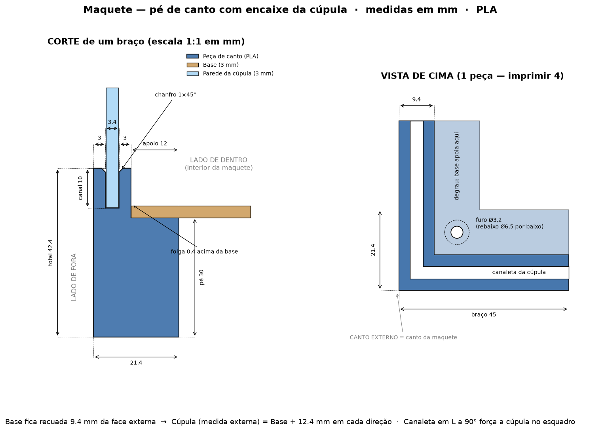
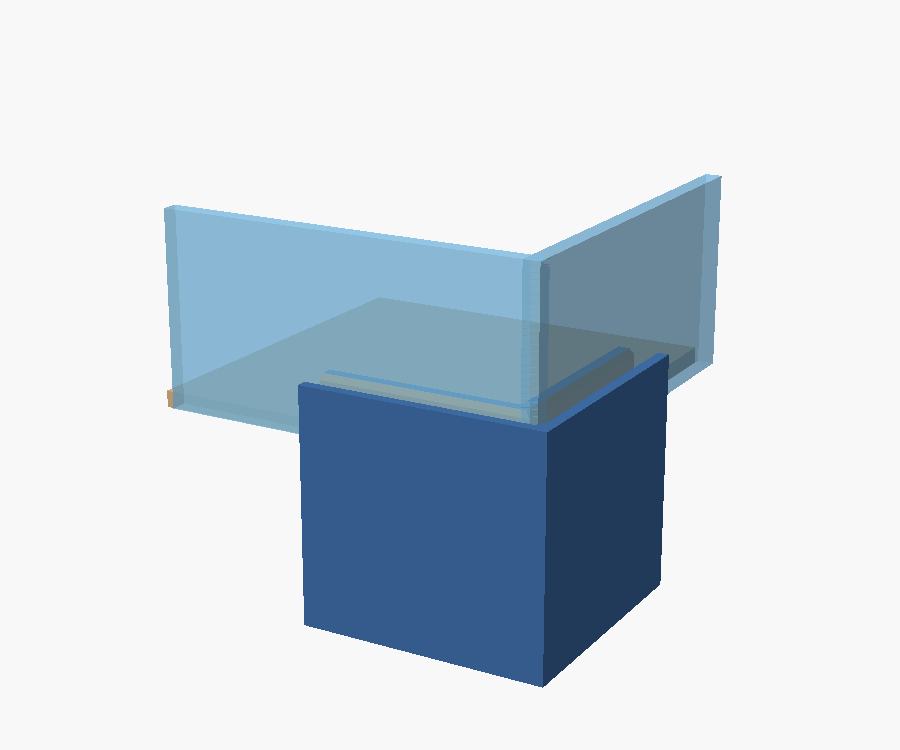
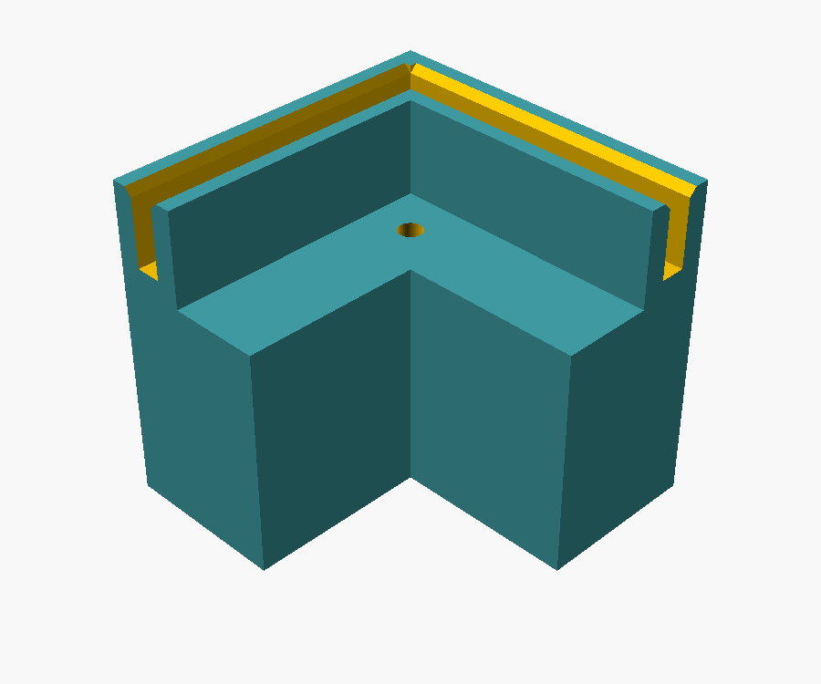
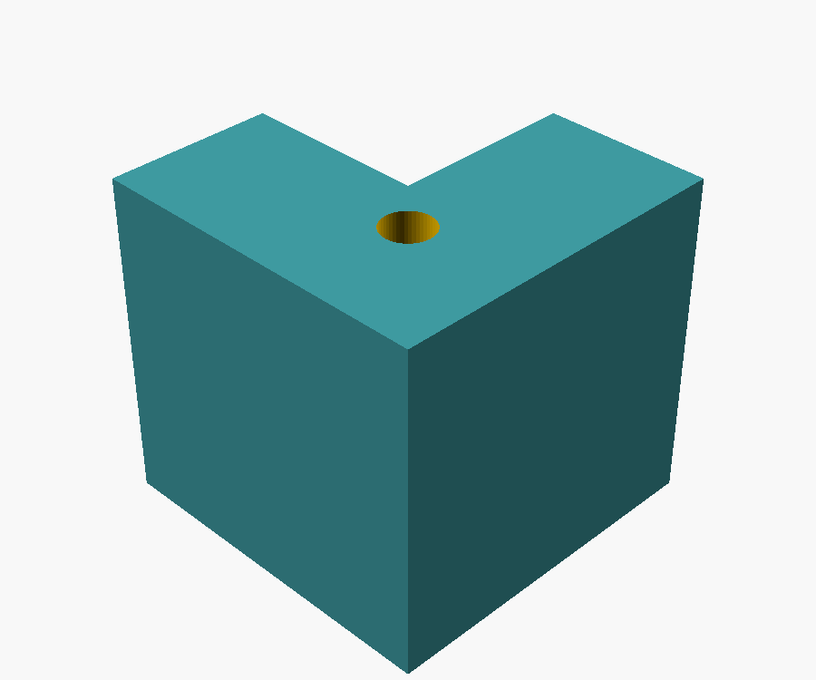

# Maquete: pé de canto + encaixe da cúpula

A cúpula deixa de encaixar por cima da base. Agora são **4 peças de canto iguais** (PLA), cada uma com:

1. **Pé de 30 mm**: levanta a base do chão.
2. **Degrau em L**: o canto da base apoia aqui (furo Ø3,2 opcional para parafuso por baixo).
3. **Canaleta em L a 90°**: a parede da cúpula entra 10 mm. A canaleta trava os dois lados do canto, então a cúpula só entra no esquadro. Tem chanfro na entrada para guiar.



| Montagem | Lado de dentro | Lado de fora | Por baixo |
|---|---|---|---|
|  |  |  |  |

## Arquivos
- `canto_pe_cupula.scad`: modelo paramétrico (é desse arquivo que sai o STL)
- `montagem_preview.scad`: só para visualizar a peça com a base e a cúpula
- `desenho_tecnico.py`: gera `img/desenho_tecnico.png`

## Medidas a confirmar antes de gerar o STL
Os valores atuais são suposições:
- espessura da base = **3 mm**
- espessura da parede da cúpula = **3 mm**
- folgas = **0,4 mm** (bom ponto de partida para PLA)

Regra de tamanho: **cúpula (medida externa) = base + 12,4 mm** em cada direção
(a base fica recuada 9,4 mm da face externa do pé).

## Gerar o STL
```
openscad -o canto_pe_cupula.stl canto_pe_cupula.scad
```
Impressão sugerida: deitado com o pé para baixo (como no desenho), sem suporte, 0,2 mm, 3 perímetros, 20% de infill.
