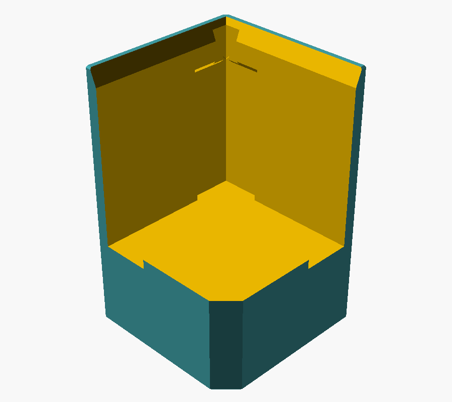
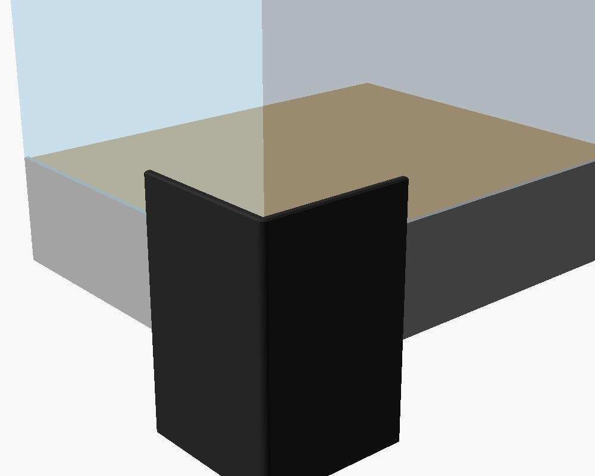
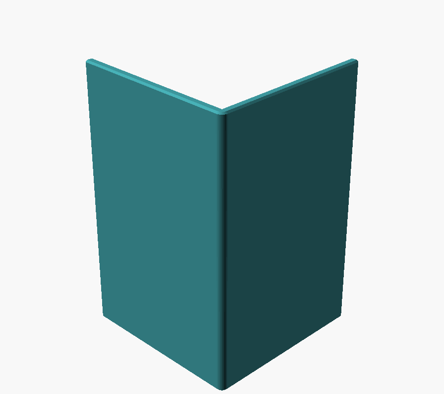
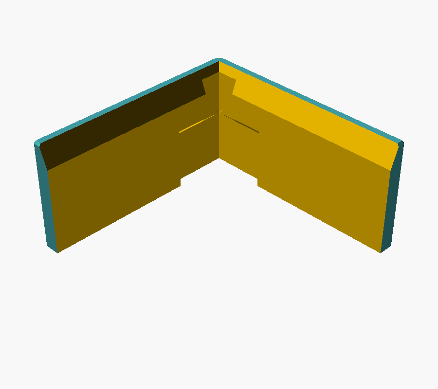
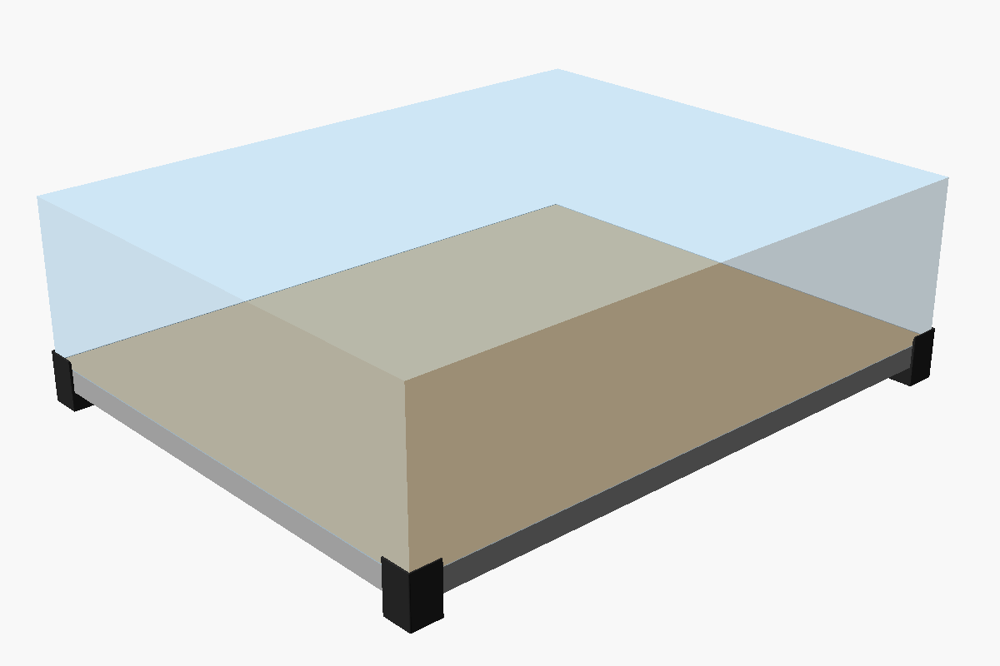

# Maquete SAMA 3: peça de canto

**Base:** 1000 × 800 mm, 35 mm de altura, com perfil de alumínio em volta.
**Cúpula:** acrílico de 6 mm.

São **4 peças iguais em PLA**, uma em cada canto. A peça é simétrica na diagonal, então a mesma peça serve nos 4 cantos. Cada uma faz três coisas:

1. **Pé de 30 mm:** levanta e segura a base. A base apoia num quadrado de 31 × 31 mm, longe do perfil.
2. **Capa da quina:** a parede de 4 mm cobre a quina imperfeita do perfil de alumínio em toda a altura e 46 mm para cada lado.
3. **Luva da cúpula:** a parede sobe 15 mm acima da base. A cúpula desce por um funil e apoia direto na base.


## Por que a cúpula fica rente

A face interna da parede em L é **um plano só, contínuo**:
- embaixo, o **perfil de alumínio** encosta nela;
- em cima, o **acrílico** encosta nela.

Os dois encostam na mesma face, então a cúpula fica **rente à base por construção** e **não tem como passar para fora**. Isso não depende da precisão da impressão nem da espessura exata do acrílico. A única coisa que fica para fora são as peças de PLA: 4 mm, só nos cantos.

Não há plástico embaixo do acrílico. Ele apoia direto na base em todo o contorno, sem fresta nos lados.

## Alívios para o perfil imperfeito

| Detalhe | Medida | Para quê |
|---|---|---|
| Bolsa na quina | 2 mm de fundo, 12 mm para cada lado, até 2 mm acima do topo da base | A quina torta do perfil (degrau, fresta, rebarba, ponta sobrando) **não encosta** na peça. A peça só se apoia no perfil reto, depois de 12 mm. |
| Rebaixo no topo do pé | 15 × 3 mm | Folga para aba de baixo do perfil (U/L) ou rebarba. A base apoia na madeira, não no alumínio. |
| Entalhe na quina | 1,2 × 4 mm | Folga para a aresta colada da caixa de acrílico e para sobra de cola. |
| Funil | 2 mm × 5 mm | Guia a cúpula ao descer. |

| Peça | Montagem | Por fora | Teste rápido |
|---|---|---|---|
|  |  |  |  |



## Arquivos

- `canto_sama3.scad`: modelo paramétrico (OpenSCAD). Todas as medidas ficam no topo do arquivo.
- `stl/canto_sama3.stl`: peça inteira, imprimir 4.
- `stl/canto_sama3_teste_rapido.stl`: só a fatia de cima (25 mm, cerca de 10 g). **Imprima primeiro** para testar no canto real.
- `montagem_sama3.scad`: só para visualizar a montagem (não imprimir).
- `desenho_tecnico.py`: gera `img/desenho_tecnico.png` cortando a malha do próprio modelo.

Para gerar de novo depois de mudar um parâmetro:
```
openscad -o stl/canto_sama3.stl canto_sama3.scad
openscad -o stl/canto_sama3_teste_rapido.stl -D teste_rapido=true canto_sama3.scad
python3 desenho_tecnico.py
```

## Impressão (PLA)

- Em pé, com o pé na mesa, **sem suporte** (nada passa de 45°).
- 0,2 mm de camada, 4 perímetros, 15% de infill (gyroid), 5 camadas no topo.
- **Costura (seam) na ponta dos braços ou na quina de dentro, nunca na face interna.** Uma costura saltada ali empurra a cúpula para fora.
- Volume de 87 cm³. Estimativa: cerca de 40 g e 3,5 h por peça (depende do fatiador).
- Cor sugerida: preto fosco ou cinza/prata.

## Teste e montagem

1. **Confira as medidas antes:** a cúpula, medida **por fora na borda de baixo**, tem que ser **igual ou menor** que a base medida por cima do perfil. Se for menor em D mm, use `recuo = D/2` (até 2 mm). Se for **maior**, nenhuma peça de canto consegue deixar a cúpula rente.
2. **Teste rápido:** encoste a fatia no canto da base, com a parte de baixo dela uns 10 mm abaixo do topo da base, e empurre na diagonal. Confira:
   - as duas faces encostam no perfil reto;
   - a quina torta do perfil não encosta;
   - ao descer a quina da cúpula na fatia, não fica degrau entre o alumínio e o acrílico (passe uma régua).
3. Imprima as 4 peças.
4. Apoie a base em calços (mais de 45 mm de altura) e encaixe cada peça por baixo do canto. Empurre na diagonal até as duas paredes encostarem no perfil. Tire os calços.
5. Desça a cúpula reta, com as quinas sobre as 4 peças. O funil guia até ela apoiar na base.

**Nunca** coloque fita, feltro ou cola entre a parede da peça e o perfil: isso empurra o plano para fora. Fita dupla face só no topo do pé, que fica na horizontal.

**Fixação definitiva (opcional):** `furo_parafuso = true` abre um rasgo diagonal para um parafuso 3,5 mm de baixo para cima, entrando na base. O rasgo permite ajustar a posição antes de apertar. Fure a película de 0,2 mm com broca de 4 mm.

## Medidas ainda a confirmar

- Medida externa da cúpula na borda de baixo (comprimento, largura e as duas diagonais), e se os 1000 × 800 são medidos por cima do perfil.
- Formato do perfil: L, U ou chapa lisa; espessura; se passa acima do topo da base ou abaixo do fundo.
- Tamanho do defeito nas quinas: até quantos mm a partir da quina.
- Se o "pezinho de 3 cm" é mesmo a altura que levanta a base da mesa (foi o que foi usado).
