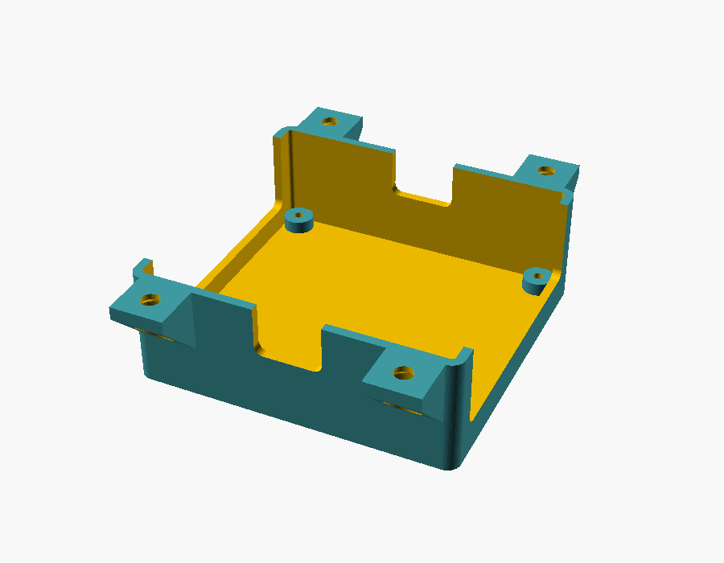
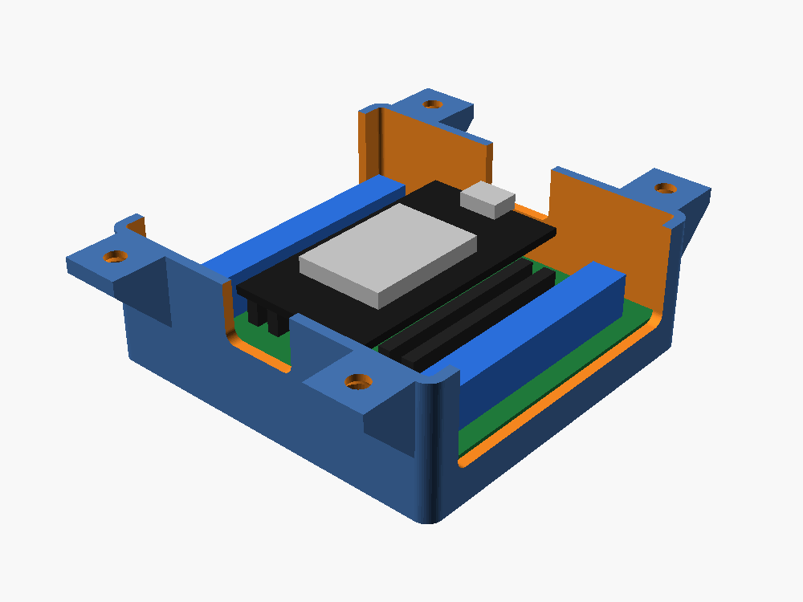
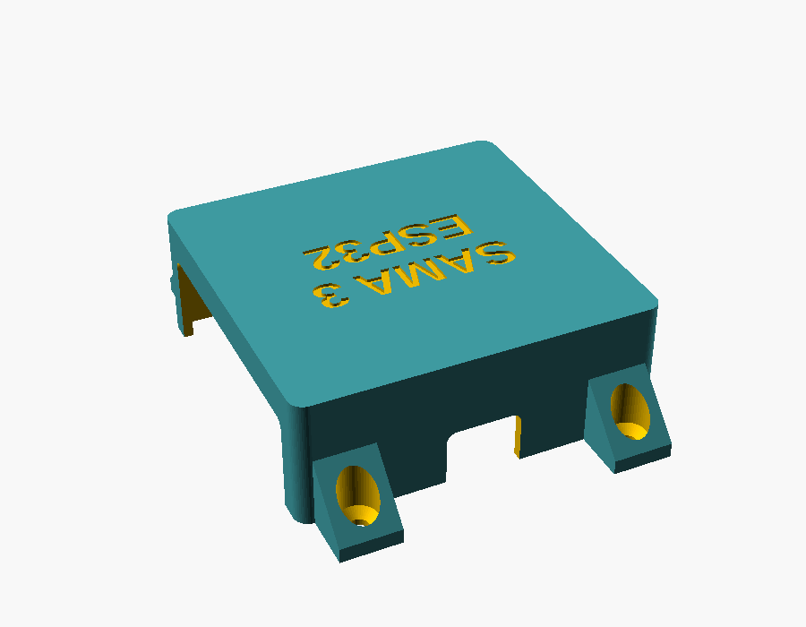
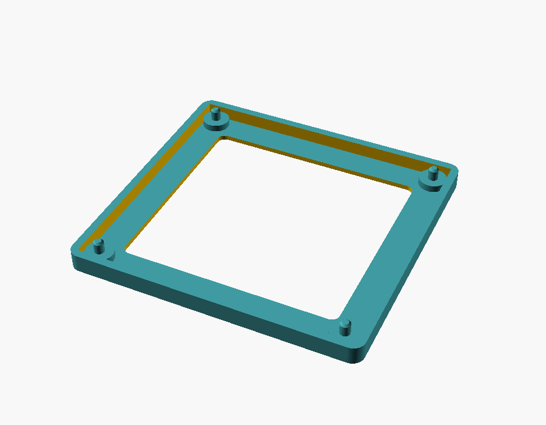
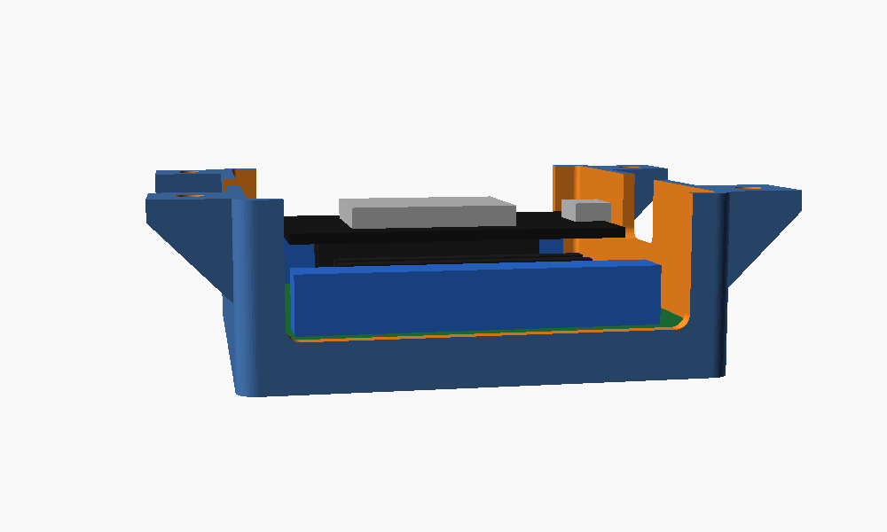
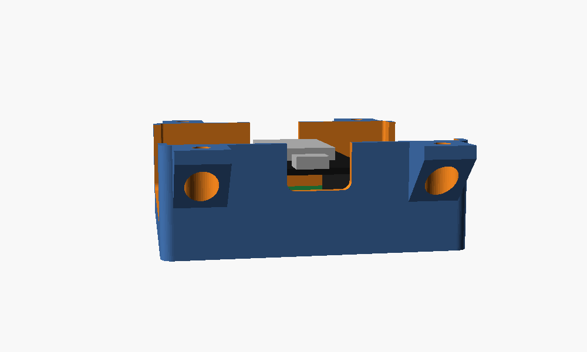

# Case do ESP32 (adaptador de bornes MRD068A), embaixo da maquete

Case para o **adaptador de bornes ESP32 30 pinos (MRD068A)** com o **ESP32 DevKit** já encaixado. Ela fica presa embaixo da maquete Sama 3.

- O conjunto montado mede **20 mm** de altura. A case tem **26 mm** de altura total: com o pé de 30 mm, sobram **4 mm** até a mesa. Os 3,5 mm acima do ESP32 deixam espaço para o plugue do cabo USB.
- Medida externa: **72 × 69 mm**, mais as 4 orelhas de fixação (91 mm no total, nas pontas).

| Case | Com a placa | Por baixo | Gabarito de teste |
|---|---|---|---|
|  |  |  |  |

| Lado dos bornes (fios) | Lado do USB |
|---|---|
|  |  |

## Como funciona

- **Bandeja aberta em cima:** a face de baixo da maquete fecha a case. Não tem tampa.
- **Placa:** fica sobre 4 colunas, com os bornes e o ESP32 virados para cima, presa com 4 parafusos M2,5 × 5. Os parafusos seguram a placa quando a case é virada na instalação.
- **Saídas laterais em U, abertas na borda de cima.** Dá para deitar os fios, até com conector, antes de parafusar a case na maquete.
  - Nas **duas paredes dos bornes:** um rasgo comprido (56 mm) na frente de cada fileira de 15 bornes, começando logo acima da placa, na altura da entrada dos fios.
  - Nas **duas pontas:** um rasgo de 15 mm para o **USB do ESP32**. Tem dos dois lados, então a placa entra em qualquer sentido.
- **Fixação:** 4 orelhas com furo escareado por baixo. O parafuso entra de baixo para cima na maquete. Com a maquete nos pés só sobram 4 mm embaixo da case, então **para colocar ou tirar a case é preciso levantar a base** (veja Montagem). Ao soltar, a case sai inteira, com a placa e os fios.
- **Texto** "SAMA 3 / ESP32" gravado no fundo, em duas linhas.

## Antes de imprimir: conferir a furação

As lojas não concordam na distância entre os furos da placa. Ao longo dos bornes as fontes dão de 57,5 a 59 mm; entre um lado de bornes e o outro, de 60 a 63,7 mm. O modelo usa **61 × 58,5 mm**.

1. Imprima o **`stl/gabarito_furos.stl`** (moldura fina com 4 pinos, uns 15 minutos).
2. Encaixe a placa nos pinos. Se ela entrar nos 4 pinos sem forçar e descer até as colunas por dentro da moldura (que tem a medida interna da case), a furação e o tamanho estão certos.
3. Se não entrar, meça com paquímetro a distância **de centro a centro** dos furos (borda interna de um furo até a borda interna do outro, mais 3 mm). Ajuste `furo_dx` (entre os lados de bornes) e `furo_dy` (ao longo dos bornes) no `case_mrd068a.scad` e gere de novo.

Confira também:
- se a placa tem **15 bornes de cada lado** (versão 30 pinos, cerca de 66 × 63 mm). Se tiver 19, é a versão de 38 pinos, maior, e as medidas mudam;
- quanto os pinos passam por baixo da placa (`pinos_baixo = 2,5`; a coluna tem 3 mm).

## Arquivos

- `case_mrd068a.scad`: modelo paramétrico (OpenSCAD). As medidas ficam no topo.
- `stl/case_mrd068a.stl`: a case.
- `stl/gabarito_furos.stl`: teste da furação.
- `montagem_case.scad`: só para ver a placa dentro da case (não imprimir).

Gerar de novo:
```
openscad -o stl/case_mrd068a.stl case_mrd068a.scad
openscad -o stl/gabarito_furos.stl -D gabarito=true case_mrd068a.scad
```

## Impressão (PLA)

- Com o fundo na mesa (como no arquivo), **sem suporte**. As orelhas têm mão-francesa a 45°.
- 0,2 mm de camada, 3 perímetros, 15–20% de preenchimento.
- O texto fica gravado 0,6 mm no fundo (3 primeiras camadas). Se não sair bem, use `texto = []` ou ligue a compensação de pé de elefante do fatiador.

## Montagem

Com a maquete apoiada nos pés, só sobram 4 mm embaixo da case. Por isso a case é parafusada com a base levantada.

1. Coloque a placa (com o ESP32) nas colunas e prenda com 4 parafusos **M2,5 × 5** auto-atarraxantes. Não use mais comprido que 5 mm: o furo da coluna tem 4,4 mm. Para M3, mude `furo_coluna` para 2,6.
2. **Escolha o lugar:** embaixo da base, a alguns centímetros de uma das bordas compridas e longe dos pés de canto. Deixe a ponta do **USB virada para a borda** (fica fácil de alcançar) e a ponta da **antena virada para o centro**, longe do perfil de alumínio.
3. **Instale antes de assentar a base nos pés** (ou, depois, tire a cúpula e apoie a base em blocos de uns 10 cm, ou incline a base apoiada numa borda comprida). Depois de mexer, reencaixe os pés de canto como no README da maquete (passos 4 a 6).
4. Ligue os fios nos bornes e deite-os nos rasgos laterais.
5. Encoste a case embaixo da base e prenda com 4 parafusos de madeira **3,5 × 16 mm**, cabeça chata, de baixo para cima. Use uma chave de haste fina com pelo menos 30 mm, ou um bit longo, porque a parede e a mão-francesa ficam perto do furo. A base tem 35 mm: não passe de 30 mm de parafuso.
6. Cabo USB: o rasgo deixa uns 5,4 mm acima do centro do conector. Plugues finos passam com a case montada. Para plugue grosso, use um cabo com plugue fino ou em ângulo (L).
