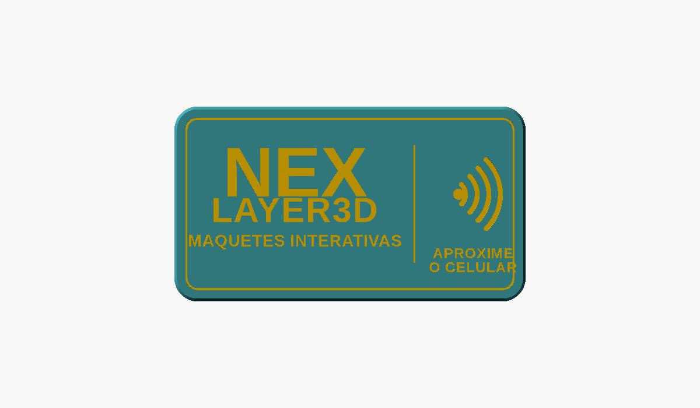
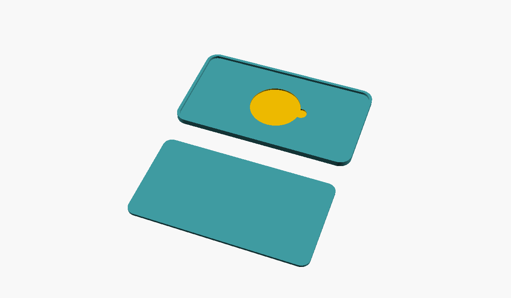

# Plaquinha de identificação com etiqueta NFC

Plaquinha **NEX LAYER3D · Maquetes Interativas** com o símbolo de aproximação e uma etiqueta NFC escondida dentro. Duas partes, impressas juntas na mesma mesa, com bico de 0,2 mm.

| Face (como fica) | As duas partes, por trás |
|---|---|
|  |  |

## Como é

- **Tamanho:** 90 × 50 mm, cantos R6, chanfro de 0,8 mm na borda da face. Montada, 3,7 mm de espessura.
- **Frente** (`plaquinha_nfc_frente.stl`): imprime com a **face para baixo**. O texto, o símbolo de aproximação e os filetes ficam **rebaixados** na face que encosta na mesa: o acabamento sai liso da mesa e as bordas ficam nítidas. No modelo o texto está espelhado de propósito, para sair certo.
  - "NEX" e "LAYER3D" rebaixados 0,6 mm; "MAQUETES INTERATIVAS" e "APROXIME O CELULAR" idem; filete da borda e divisor rebaixados 0,3 mm.
  - Atrás: um bolso redondo para a etiqueta NFC (Ø25 + 0,6 de folga, 0,8 mm de fundo, com um rebaixo para a unha) e uma moldura de 1,5 mm onde a tampa encaixa.
- **Tampa** (`plaquinha_nfc_tampa.stl`): chapa de 1,2 mm que entra na moldura (0,15 mm de folga por lado) e fecha rente. Cola com cola instantânea nos cantos.
- O NFC lê bem através dos 2,4 mm de PLA da frente. Se a etiqueta for maior que 25 mm, mude `nfc_d` no `.scad`.

## Impressão (bico 0,2 mm)

- Use `stl/plaquinha_nfc_ambas.stl`: as duas peças já vêm lado a lado, na posição certa (frente com a face para baixo). **Não gire.**
- Camada **0,1 mm**, 3 paredes, 20% de preenchimento, sem suporte. Mesa lisa (PEI liso ou vidro) para o acabamento da face.
- Estimativa (PrusaSlicer, perfil de 0,2 mm): **~2 h 37 min**, 15 g.
- **Texto em duas cores:** o rebaixo do texto tem 0,6 mm. Imprima as 6 primeiras camadas numa cor (a do texto), troque o filamento em 0,6 mm e siga com a cor da plaquinha. Para pegar também os filetes (0,3 mm), a troca em 0,6 mm já cobre.

## Montagem

1. Cole a etiqueta NFC no bolso, atrás da frente.
2. Encaixe a tampa na moldura e cole nos cantos.
3. Fixe com fita dupla face fina atrás, na maquete ou na mesa.

## Arquivos

- `plaquinha_nfc.scad`: modelo paramétrico (textos, tamanhos e posições no topo do arquivo).
- `stl/plaquinha_nfc_ambas.stl`: as duas peças juntas, na posição de impressão.
- `stl/plaquinha_nfc_frente.stl`, `stl/plaquinha_nfc_tampa.stl`: separadas.

Gerar de novo:
```
openscad -o stl/plaquinha_nfc_ambas.stl plaquinha_nfc.scad
```
