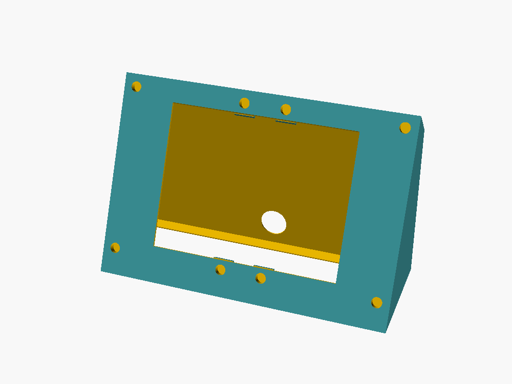
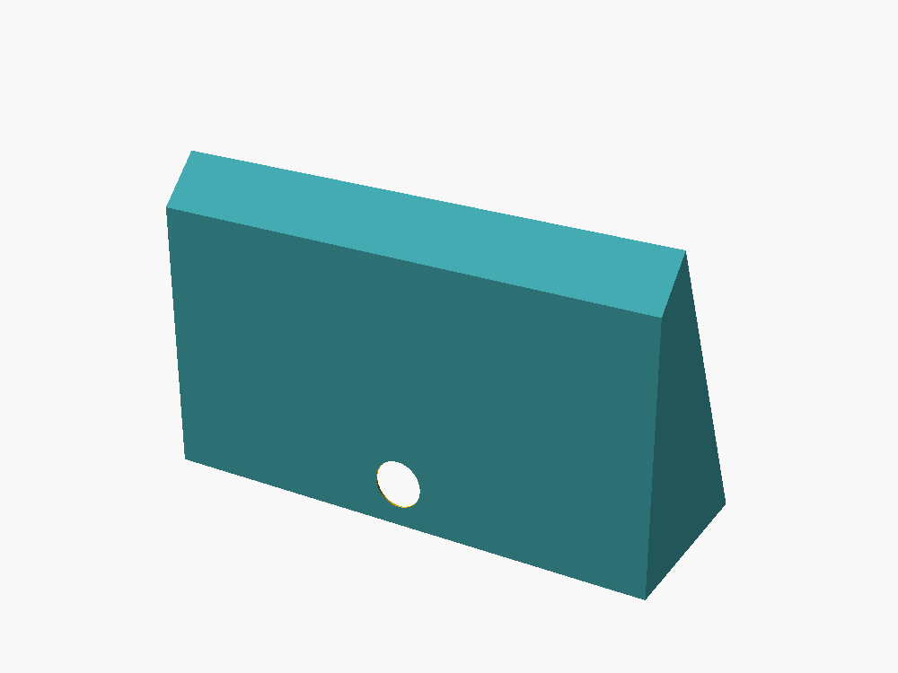
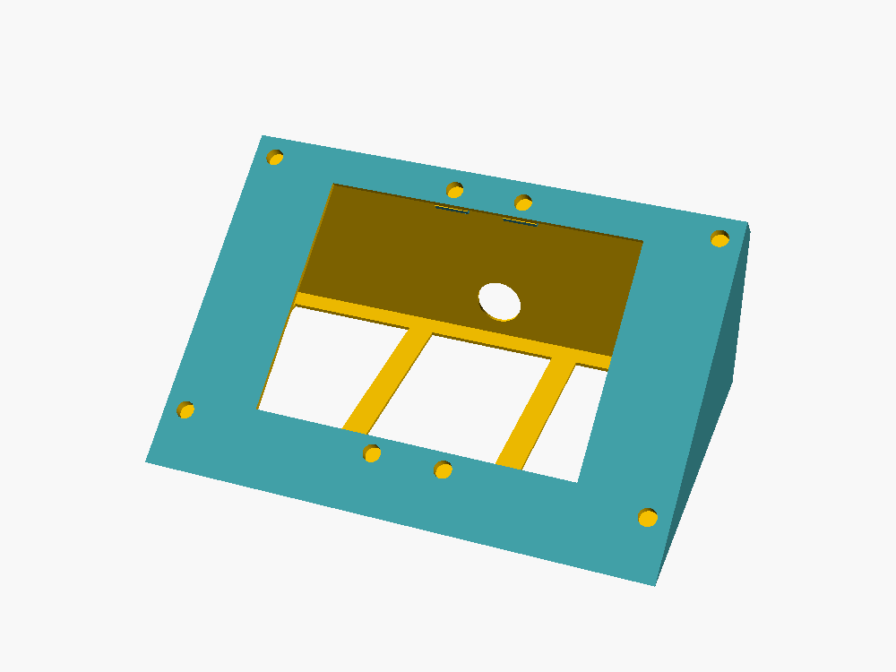
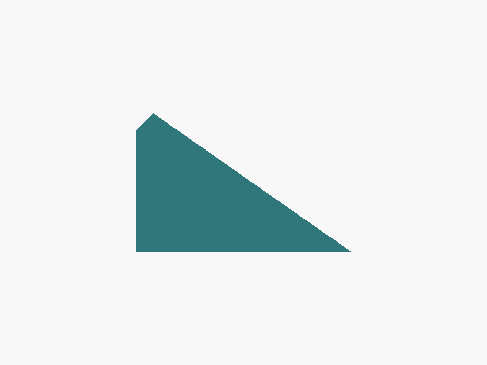
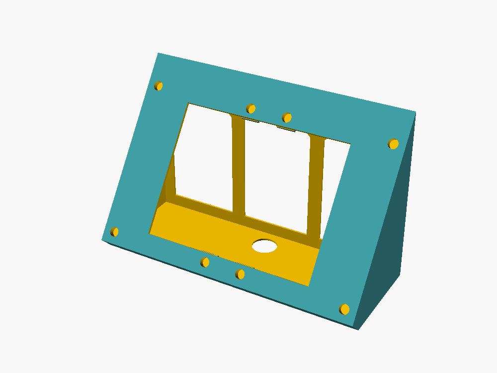
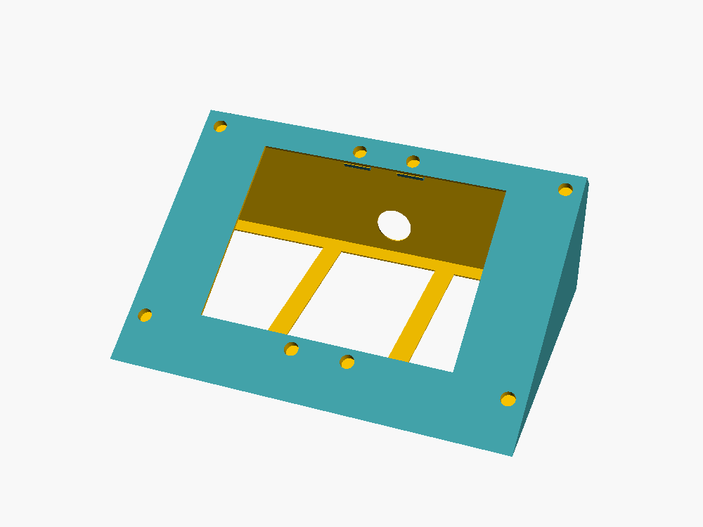
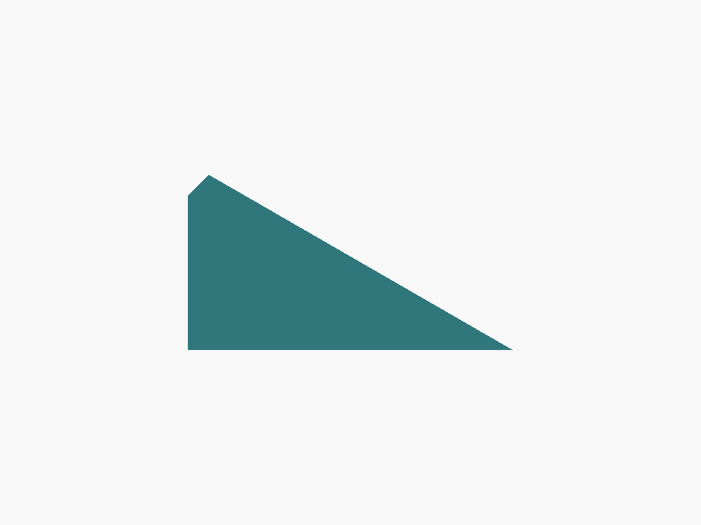
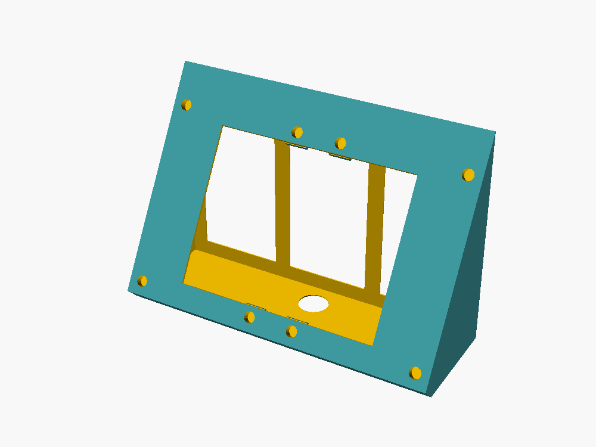

# Suporte da tela Guition 10,1" (JC8012P4A1C, ESP32-P4)

Suporte de mesa **fechado**, igual ao do modelo de 7": uma caixa em cunha fechada embaixo, atrás e dos lados. A própria tela fecha a frente. Ele fica na mesa ao lado da maquete; na Sama 3 a cúpula cobre a base inteira.

| Suporte | Com a tela | Por trás | De lado |
|---|---|---|---|
|  |  |  |  |

## Medidas da tela

Tiradas do desenho oficial da Guition (`JC8012P4A1_desenho_guition.pdf`, nesta pasta):
- vidro de **242,8 × 158,7 mm**, espessura total de 22,51 mm (painel de 7 mm + caixa de 15,51 mm atrás);
- **6 colunas de latão** (Ø7,5, 4,5 mm de altura) a 15 mm das bordas: **212,8 × 128,7 mm** entre as dos cantos. A do meio fica 16,4 mm fora do centro (90 + 122,8 mm);
- caixa da eletrônica de 138,35 × 93,5 mm, centralizada, com os USB-C na lateral comprida.

## Como é

- **Tamanho:** 237 × 137 × 127 mm. Cabe na mesa de 256 × 256 (Bambu P1/X1/A1). Não cabe na A1 mini.
- **Inclinação:** a tela fica deitada (paisagem), a **50°** da mesa (`angulo`), ou seja, 40° para trás da vertical. Mais deitado que isso não dá para imprimir sem suporte (mínimo 45°).
- **Sem parafuso:** a borda da abertura tem **8 encaixes** (Ø8,2 × 5 mm). As colunas de latão da tela entram neles e a chapa de trás apoia na borda, então a tela fica presa pelo próprio peso. Para tirar, é só levantar.
  - São 8 encaixes porque cabem os 6 da tela também com ela virada 180°.
- **Caixa da tela:** a caixa preta de trás entra na abertura. Sobram 5 mm nas pontas e 10 mm em cima e embaixo, onde ficam os USB-C. A borda de cima é chanfrada a 45°, então em cima a folga cai para uns 8 mm no lado de dentro da borda. Por isso, **monte a tela com o lado dos USB-C para baixo**, onde ficam os 10 mm inteiros.
- **Cabo:** use **USB-C em L (90°)**. O plugue vira para dentro do suporte e o cabo sai pelo **furo de trás** (Ø22) ou pelo **túnel da frente**, embaixo da tela.
- **Fixação na mesa (opcional):** 2 furos no fundo, escareados por dentro, embaixo da abertura (com a tela fora, a chave entra na vertical).
- **Logo NEX LAYER3D** gravado nas duas laterais.

## Versão fina (impressão rápida, ~2 h)

`stl/suporte_tela10_fino.stl` (`suporte_tela10_fino.scad`): mesmo formato fechado e mesmo encaixe da tela, mas:
- paredes de **0,9 mm** (2 linhas) e face de **1,8 mm**;
- só uma pastilha em volta de cada encaixe, no lugar da borda grossa;
- fundo vazado (só uma moldura na mesa);
- sem logo, sem túnel na frente e sem furos para a mesa (o cabo sai pelo furo de trás);
- **233 × 116 × 124 mm**, cerca de **103 g**, mesma inclinação de **50°**.

Tempo estimado no PrusaSlicer com velocidades de Bambu P1S/X1 (bico 0,4):
- **camada 0,28 mm: ~1 h 57 min** (use o perfil "0.28mm Extra Draft");
- camada 0,2 mm: ~2 h 28 min.

Fatie com **2 paredes, 15% de preenchimento, sem suporte**. Por ser fina, trate com cuidado e não aperte a face.

| Frente | Trás |
|---|---|
|  |  |

## Versão mais deitada e mais grossa

`stl/suporte_tela10_deitado.stl` (`suporte_tela10_deitado.scad`, que usa o `suporte_tela10_fino.scad` com outros valores):
- tela a **35° da mesa** (55° para trás da vertical);
- paredes de **1,6 mm** e face de **2,4 mm** (quase o dobro da fina);
- **233 × 148 × 95 mm** em uso; mesmo encaixe da tela, sem parafuso;
- o fundo tem 3 janelas com topo em Λ.

**Já vem girado para imprimir de costas** (a traseira na mesa da impressora). Nessa posição a face fica a 35° da vertical e **imprime sem suporte**. Não gire a peça no fatiador.
- Estimativa (PrusaSlicer, velocidades de Bambu): **camada 0,28 mm ~3 h 27 min**; camada 0,2 mm ~4 h 30 min; cerca de 160 g.
- Se preferir imprimir em pé, gere com `imprimir_de_costas = false` e ligue suporte (árvore) no fatiador: fica mais lento (~4 h com 0,2 mm) e o suporte fica dentro da caixa.

| Em uso | De lado | Posição de impressão |
|---|---|---|
|  |  |  |

## Versão de mesa, pequena e bem deitada (30°)

`stl/suporte_tela10_mesa.stl` (`suporte_tela10_mesa.scad`, que usa o `suporte_tela10_fino.scad` com outros valores):
- tela a **30° da mesa** (60° para trás da vertical), só **84 mm de altura**;
- paredes finas (0,9 mm) e face de 1,8 mm, sem logo;
- **233 × 156 × 84 mm** em uso; mesmo encaixe da tela, sem parafuso;
- fundo com 3 janelas de topo em Λ.

**Já vem girado para imprimir de costas** (a traseira na mesa da impressora): a face fica a 30° da vertical e **imprime sem suporte**. Não gire a peça no fatiador.
- Estimativa (PrusaSlicer, velocidades de Bambu): **camada 0,28 mm ~2 h 25 min**; camada 0,2 mm ~2 h 55 min; cerca de 100 g.
- Impressa de costas a peça fica com 156 mm de altura na impressora, por isso demora um pouco mais que a fina de 50°.

| Em uso | De lado | Posição de impressão |
|---|---|---|
|  |  |  |

## Arquivos

- `stl/suporte_tela10.stl`: o suporte (peça única, versão completa).
- `stl/suporte_tela10_fino.stl`: versão fina, impressão rápida.
- `stl/suporte_tela10_deitado.stl`: versão mais deitada (35°) e mais grossa, já girada para imprimir de costas.
- `stl/suporte_tela10_mesa.stl`: versão de mesa pequena, 30°, fina, já girada para imprimir de costas.
- `suporte_tela10.scad`: modelo paramétrico (OpenSCAD).
- `montagem_suporte.scad`: só para ver o suporte com a tela (não imprimir).
- `JC8012P4A1_desenho_guition.pdf`: desenho mecânico da Guition.

Gerar de novo:
```
openscad -o stl/suporte_tela10.stl suporte_tela10.scad
```

## Impressão (PLA)

- Em pé, com o fundo na mesa (como no arquivo), **sem suporte**. A face, o chanfro de cima e a borda de cima da abertura ficam a no máximo 45° da vertical.
- A borda de cima da abertura começa com uma ponte de uns 150 mm. Pode ficar um pouco irregular, mas fica escondida atrás da tela. Se sobrar algum fio pendurado, corte com estilete antes de encaixar o plugue.
- 0,2 mm de camada, 3 perímetros, 15% de preenchimento. Volume de 366 cm³: é uma impressão longa (versão completa).

## Montagem

1. Ligue o cabo USB-C em L na tela e passe o cabo pela abertura até o furo de trás (ou o túnel da frente).
2. Encaixe a tela com o lado dos USB-C para baixo: apoie a borda de baixo, depois deite a tela na face até as colunas de latão entrarem nos encaixes.
3. **Fixar na mesa (opcional):** com a tela fora, use 2 parafusos de madeira **3,5 × 16 mm** pelos furos do fundo, por dentro do suporte. Se não for parafusar, 4 pezinhos de borracha adesivos embaixo evitam que ele escorregue quando você toca na tela.

Se quiser a tela mais firme (por exemplo, para transportar), uma gota de cola quente ou fita dupla face fina na borda segura bem e sai depois.

## Ajustes no `.scad`

- `angulo`: inclinação (padrão 50°). Valores maiores deixam a tela mais em pé (65° era a versão anterior). Imprime sem suporte entre 45° e 80°.
- `fundo_atras`: quanto a traseira fica atrás do topo. Mais fundo dá mais estabilidade ao tocar na tela.
- `encaixe_d`: diâmetro dos encaixes. Aumente se as colunas entrarem justas demais.
- `furo_tras_d`, `rebaixo_frente_r`: passagem do cabo (furo de trás e túnel da frente; `rebaixo_frente_r = 0` tira o túnel).
- `logo = false` tira o logo.
