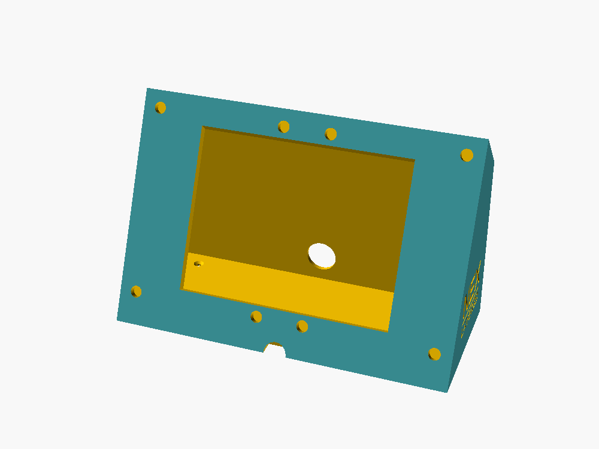
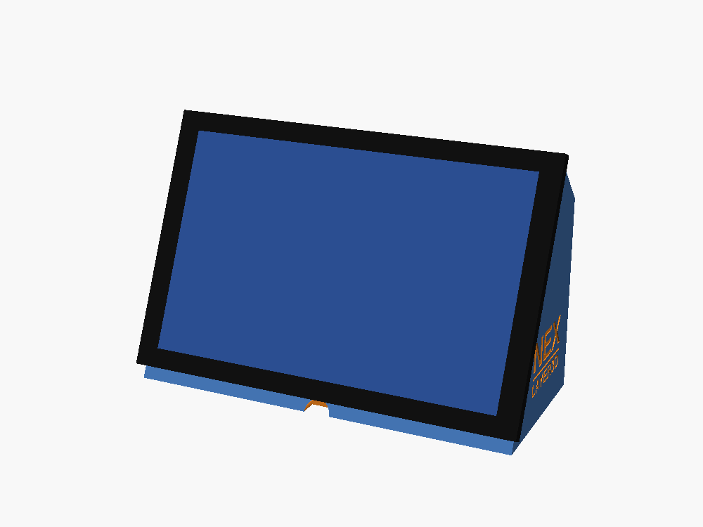
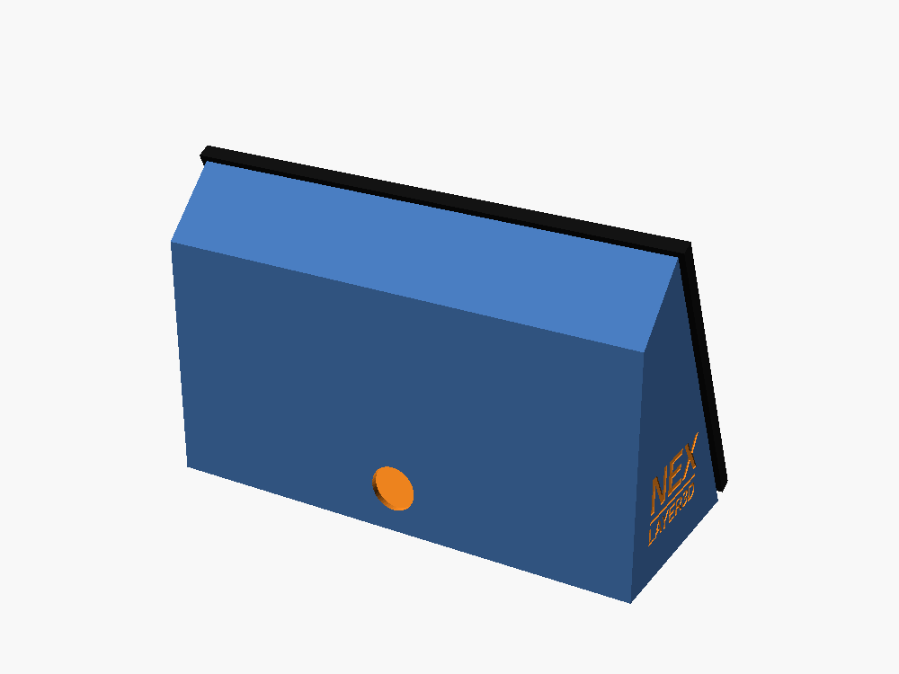
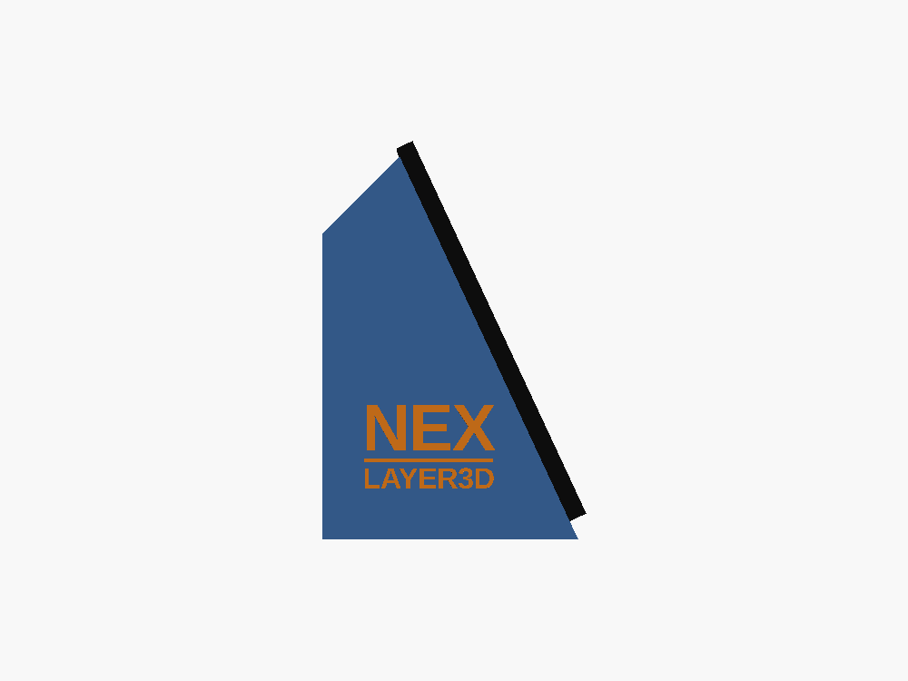

# Suporte da tela Guition 10,1" (JC8012P4A1C, ESP32-P4)

Suporte de mesa **fechado**, igual ao do modelo de 7": uma caixa em cunha fechada embaixo, atrás e dos lados. A própria tela fecha a frente. Ele fica na mesa ao lado da maquete; na Sama 3 a cúpula cobre a base inteira.

| Suporte | Com a tela | Por trás | De lado |
|---|---|---|---|
|  |  |  |  |

## Medidas da tela

Tiradas do desenho oficial da Guition (`JC8012P4A1_desenho_guition.pdf`, nesta pasta):
- vidro de **242,8 × 158,7 mm**, espessura total de 22,51 mm (painel de 7 mm + caixa de 15,51 mm atrás);
- **6 colunas de latão** (Ø7,5, 4,5 mm de altura) a 15 mm das bordas: **212,8 × 128,7 mm** entre as dos cantos. A do meio fica 16,4 mm fora do centro (90 + 122,8 mm);
- caixa da eletrônica de 138,35 × 93,5 mm, centralizada, com os USB-C na lateral comprida.

## Como é

- **Tamanho:** 237 × 99 × 148 mm. Cabe na mesa de 256 × 256 (Bambu P1/X1/A1). Não cabe na A1 mini.
- **Inclinação:** a tela fica deitada (paisagem), a **65°** da mesa (`angulo`).
- **Sem parafuso:** a borda da abertura tem **8 encaixes** (Ø8,2 × 5 mm). As colunas de latão da tela entram neles e a chapa de trás apoia na borda, então a tela fica presa pelo próprio peso. Para tirar, é só levantar.
  - São 8 encaixes porque cabem os 6 da tela também com ela virada 180°.
- **Caixa da tela:** a caixa preta de trás entra na abertura. Sobram 5 mm nas pontas e 10 mm em cima e embaixo, onde ficam os USB-C.
- **Cabo:** use **USB-C em L (90°)**. O plugue vira para dentro do suporte e o cabo sai pelo **furo de trás** (Ø22) ou pelo **rebaixo da frente**, embaixo da tela.
- **Fixação na mesa (opcional):** 2 furos no fundo, atrás, escareados por dentro.
- **Logo NEX LAYER3D** gravado nas duas laterais.

## Arquivos

- `stl/suporte_tela10.stl`: o suporte (peça única).
- `suporte_tela10.scad`: modelo paramétrico (OpenSCAD).
- `montagem_suporte.scad`: só para ver o suporte com a tela (não imprimir).
- `JC8012P4A1_desenho_guition.pdf`: desenho mecânico da Guition.

Gerar de novo:
```
openscad -o stl/suporte_tela10.stl suporte_tela10.scad
```

## Impressão (PLA)

- Em pé, com o fundo na mesa (como no arquivo), **sem suporte**. A face, o chanfro de cima e a borda de cima da abertura ficam a no máximo 45° da vertical.
- A borda de cima da abertura começa com uma ponte de uns 150 mm. Pode ficar um pouco irregular, mas fica escondida atrás da tela.
- 0,2 mm de camada, 3 perímetros, 15% de preenchimento. Volume de 349 cm³: é uma impressão longa, parecida com a do suporte de 7".

## Montagem

1. Ligue o cabo USB-C em L na tela e passe o cabo pela abertura até o furo de trás (ou o rebaixo da frente).
2. Encaixe a tela: apoie a borda de baixo, depois deite a tela na face até as colunas de latão entrarem nos encaixes.
3. **Fixar na mesa (opcional):** com a tela fora, use 2 parafusos de madeira **3,5 × 16 mm** pelos furos do fundo, por dentro do suporte.

Se quiser a tela mais firme (por exemplo, para transportar), uma gota de cola quente ou fita dupla face fina na borda segura bem e sai depois.

## Ajustes no `.scad`

- `angulo`: inclinação (padrão 65°). Por exemplo, 55° fica mais deitada e 75° mais em pé.
- `fundo_atras`: quanto a traseira fica atrás do topo. Mais fundo dá mais estabilidade ao tocar na tela.
- `encaixe_d`: diâmetro dos encaixes. Aumente se as colunas entrarem justas demais.
- `furo_tras_d`, `rebaixo_frente_r`: passagem do cabo.
- `logo = false` tira o logo.
