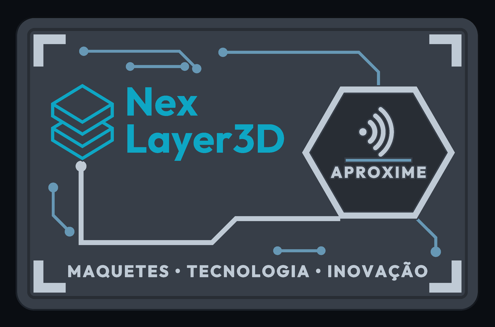
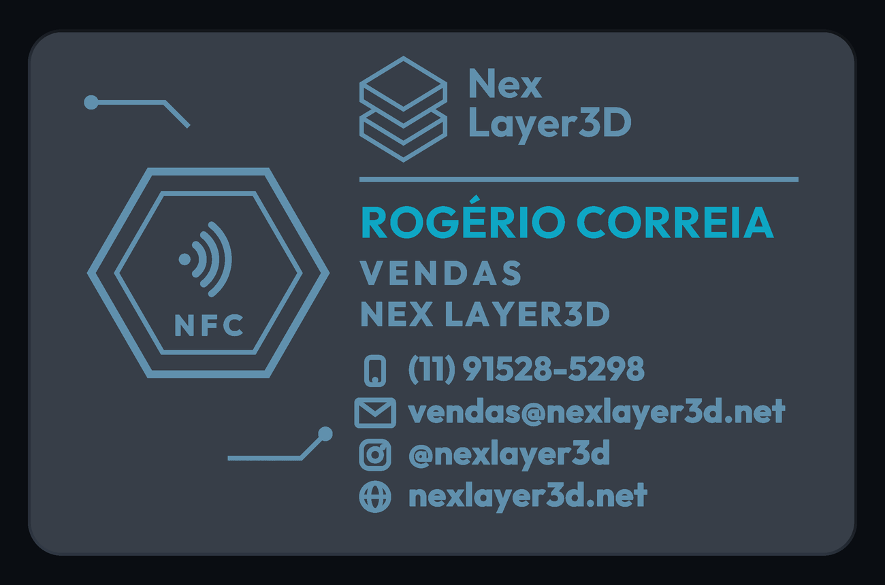
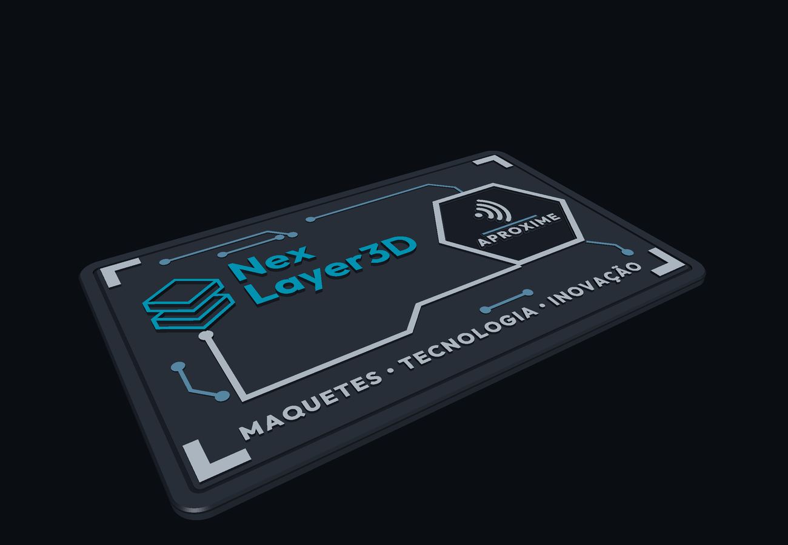
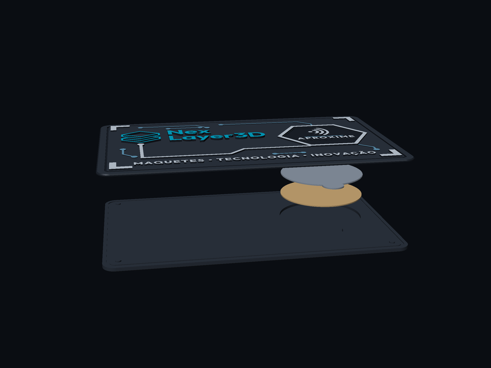
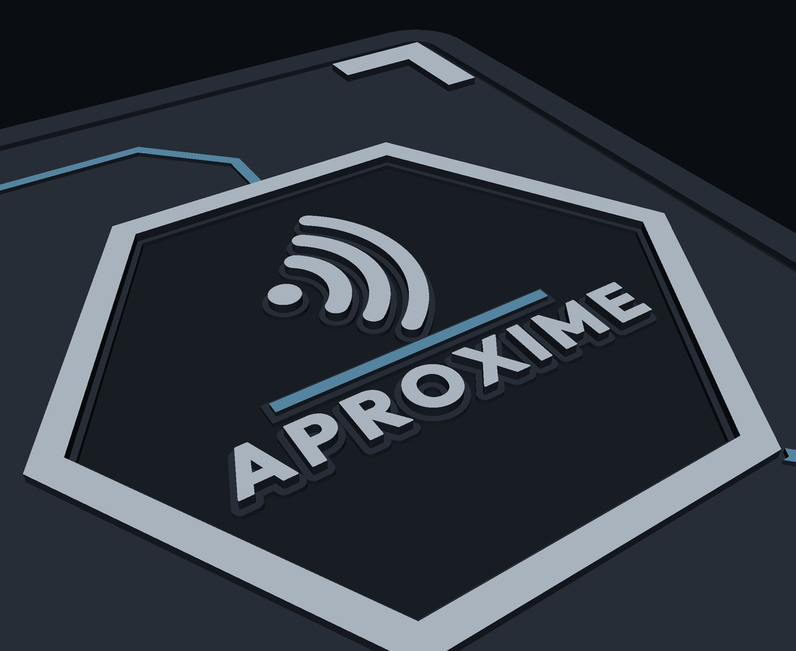

# Cartão de visita NFC — NEX Layer3D

Cartão colecionável em duas peças, para impressão 3D FDM em PLA com bico de
0,2 mm. A etiqueta NFC adesiva de 25 mm fica alojada numa cavidade interna;
a frente traz a marca em relevo e a área de aproximação hexagonal, e o verso
traz os dados de contato gravados.

Tudo é gerado por script — a arte é geometria paramétrica, não uma malha
editada à mão. Para mudar um telefone, um tamanho ou uma altura de relevo,
altera-se o valor e roda-se de novo.



## Arquivos para fatiar

| Arquivo | Peça | O que é |
|---|---|---|
| `stl/nexlayer3d_01_tampa_superior.stl` | tampa superior | frente em relevo |
| `stl/nexlayer3d_02_base_inferior.stl` | base inferior | verso gravado + cavidade NFC |
| `stl/nexlayer3d_03_tampa_fechamento.stl` | tampa de fechamento | disco fino opcional |
| `stl/nexlayer3d_04_montagem.stl` | montagem | só para conferência, não imprimir |

Unidade: **milímetro**. Cada peça já sai na orientação de impressão, com a
face plana apoiada em z = 0 — é só carregar e fatiar, sem girar nada.

## Dimensões

- Cartão: **85 × 54 mm**, cantos arredondados R 3,5 mm
- Espessura total: **2,5 mm** (tampa 1,2 + base 1,3)
- Chanfro de 0,3 mm nas duas bordas externas — aresta confortável ao toque
- Cavidade NFC: **Ø 25,2 × 0,8 mm** (etiqueta de 25 mm + 0,2 mm de folga)
- Piso sob a cavidade: 0,5 mm

### Mapa de alturas

```
 z = 2,50   topo do logo ................... +0,6
 z = 2,30   elementos gráficos ............. +0,4
 z = 2,10   linhas e trilhas ............... +0,2
 z = 1,90   plano base da frente ...........  0,0   ← face externa da TAMPA
 z = 1,60   fundo de sulco ................. -0,3
 z = 1,30   face de colagem ................        ← TAMPA | BASE
 z = 0,50   fundo da cavidade NFC
 z = 0,30   fundo da gravação profunda ..... -0,3
 z = 0,20   fundo da gravação de texto ..... -0,2
 z = 0,00   face externa do verso ..........        ← face externa da BASE
```

Todas as cotas de relevo são múltiplas de 0,1 mm, então fecham exatamente
em camadas de 0,10 mm (e também em 0,08 e 0,12 sem degrau visível).

## Impressão

| Parâmetro | Valor |
|---|---|
| Material | PLA |
| Bico | 0,2 mm |
| Altura de camada | 0,08 a 0,12 mm (0,10 recomendado) |
| Suportes | **nenhum** — não há balanço em nenhuma das peças |
| Preenchimento | 100 % (as peças são finas) |
| Paredes | 3 ou mais |
| Primeira camada | face plana na mesa, área cheia (bom aderimento) |

**Orientação (já embutida nos STL):**

- **Tampa superior** — face de colagem na mesa, relevo crescendo para cima.
  A primeira camada é o retângulo cheio de 85 × 54 mm.
- **Base inferior** — verso na mesa, cavidade abrindo para cima. A gravação
  do verso são vãos de 2 camadas que o fatiador fecha em ponte curta; sai
  nítida e deixa o verso liso.
- **Tampa de fechamento** — deitada, disco de 0,35 mm.

### Cores por altura de camada (opcional)

Cada nível de relevo ocupa uma faixa própria de z, então dá para separar
cores só com troca de filamento por camada, sem AMS:

| Trocar em | Passa a imprimir |
|---|---|
| z = 2,10 mm | linhas e trilhas de circuito |
| z = 2,30 mm | elementos gráficos, hexágono, assinatura |
| z = 2,50 mm | apenas o logo principal |

## Montagem

1. Cole a etiqueta NFC no fundo da cavidade da base. Um recorte lateral de
   Ø 7 mm serve para descolar a etiqueta depois, com a unha.
2. **Opção A — colar as duas metades.** O canal de cola no plano de colagem
   da base (0,9 mm de largura, 0,25 mm de profundidade, 1,5 mm da borda)
   recebe o excesso, para a cola não vazar na aresta. Cola de cianoacrilato
   gel ou epóxi.
3. **Opção B — sem colar as metades.** Encaixe a tampa de fechamento sobre
   a etiqueta; ela prende a etiqueta na cavidade e a montagem fica
   reversível.
4. Quatro pinos de Ø 1,6 × 0,35 mm na base entram em furos de Ø 1,8 mm na
   tampa e fazem o alinhamento — 0,2 mm de folga, a tolerância de projeto.
   Os furos ficam sob as cantoneiras da frente, onde a tampa tem 1,0 mm de
   material.

**Não coloque metal sobre a antena.** A área NFC fica sob o hexágono da
frente, centrada em (66,5; 29,0) mm — e o eco hexagonal gravado no verso
está exatamente do outro lado da mesma antena, então o cartão pode ser
aproximado por qualquer uma das faces.

## Vistas

| | |
|---|---|
|  |  |
|  |  |

## Sobre a marca

A marca da frente **não foi redesenhada no olho**. Ela foi reconstruída em
geometria exata (duas placas isométricas em traço) e os parâmetros foram
ajustados numericamente contra os pixels do logo oficial enviado, até
**0,90 de IoU** — o resto da diferença é a franja de antialiasing da
imagem de referência. `assets/logo_fit_check.png` mostra a sobreposição:
vermelho é o logo oficial, verde é o modelo, branco é o que coincide.

A grafia **NEX** (nunca NEXT) é verificada automaticamente a cada geração.

## Regerar

```bash
python3 nfc_card.py            # gera os 4 STL e roda a validação
python3 tools/preview_3d.py    # gera as vistas
python3 tools/preview_layout.py  # gera as previas 2D das camadas
```

Dados de contato, tamanhos e alturas de relevo ficam em `lib/spec.py`.
O layout da frente e do verso está em `lib/artwork.py`.

### Estrutura

```
nfc_card.py            monta as peças e exporta os STL
lib/spec.py            todas as cotas e o conteúdo de texto
lib/artwork.py         layout da frente e do verso
lib/logo.py            marca oficial em geometria exata
lib/text2d.py          contornos de fonte -> polígonos
lib/geo.py             primitivas 2D (hexágono, traço, arco, cantoneira)
lib/solid.py           2D -> sólido manifold, exportação STL
lib/validate.py        validação final
lib/render.py          renderizador z-buffer das vistas
tools/fit_logo.py      ajusta a marca contra a arte oficial
tools/trace_logo.py    vetorização direta do logo (referência)
```

## Observações

- **QR Code retirado**, conforme pedido. O espaço que ele ocupava no verso
  foi usado para trazer o bloco de contato inteiro para a direita — o que
  também tirou a gravação profunda de cima da cavidade NFC, deixando o piso
  da cavidade mais folgado.
- **Handle do Instagram:** a arte de referência escreve `@nextlayer3d`, com
  T, mas o briefing manda manter a grafia **NEX, nunca NEXT**. Usei
  `@nexlayer3d`, coerente com o domínio `nexlayer3d.net` do e-mail. Se o
  perfil real for mesmo com T, é uma linha em `lib/spec.py` (`INSTAGRAM`) e
  rodar `python3 nfc_card.py` de novo.
- **Material por cartão:** 8,22 cm³ das duas peças ≈ **10 g de PLA**
  (1,24 g/cm³), mais 0,18 cm³ se imprimir a tampa de fechamento.
- `04_montagem.stl` é o cartão montado, só para conferir encaixe no
  fatiador. Não é peça de impressão.

## Validação

`python3 nfc_card.py` mede a geometria gerada e reprova se algo sair da
especificação. São 33 verificações: malha fechada (genus 0) nas três peças,
tamanho e espessura finais, coincidência do plano de colagem, diâmetro e
piso da cavidade, folga da etiqueta, encaixe dos pinos, paredes mínimas,
detalhe mínimo de 0,4 mm em cada camada de relevo, margem de segurança de
2 mm, área da primeira camada e a grafia da marca.
